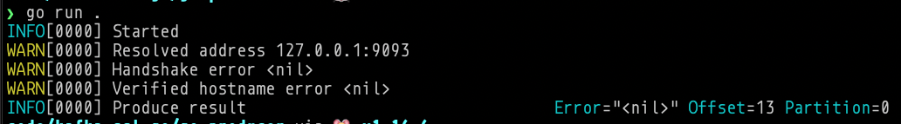
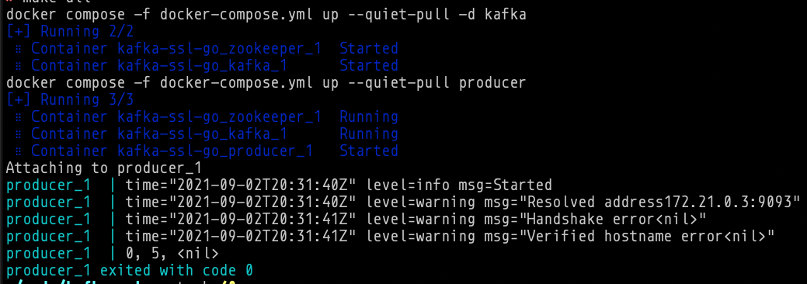

# Kafka with SSL fully set-up and connecting via Go

This is a small example for my future reference on how to create a set of certificates, with a custom authority, that work well in Kafka (and probably any other JVM system) _and_ work well with Go. For more details, please refer to [this](https://mostlymaths.net/2021/09/kafka-ssl-go.html/) post.





## What's in here

- A Dockerfile that generates a set of certificates for Kafka and Go's TLS client (`make certs`)
- A `docker-compose` file to launch Kafka+Zookeeper, and a sample Go producer that sends one message with SSL.

You can `make all` to run everything from within `docker` or `make kafka` to have a Kafka+Zookeeper in docker, and then run the go producer standalone from your local machine (this requires adding `127.0.0.1 kafka` to `/etc/hosts`). The set of certificates in the `certs` folder can be used with other languages of course (see the `kafkacat` example below).

## Test connectivity

It's always saner to use [kafkacat/kcat](https://github.com/edenhill/kcat) first, because _it has to work_. I have found that on my M1 machine Kafka (and Zookeeper, and certificate creation, basically any JVM-based image) sometimes takes a long time, sometimes hangs and I need to restart it and sometimes it segfaults. So, keep an eye: if kafkacat can't connect, restart dockers. This requires the `/etc/hosts` setup mentioned above

```bash
kcat \
 -b kafka:9093 \
 -X security.protocol=ssl \
 -X ssl.key.location=certs/producer.key \
 -X ssl.certificate.location=certs/producer-ca-signed.crt \
 -X ssl.ca.location=certs/our_ca.crt \
 -L
```
